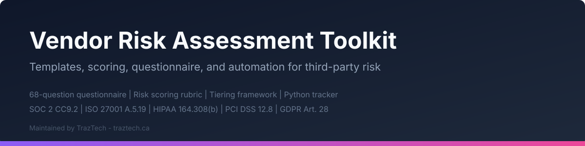

<p align="center">
  
</p>

# Vendor Risk Assessment Toolkit

**A practical, compliance-mapped toolkit for managing third-party and vendor risk.**

## Demo

<p align="center">
  
</p>

Maintained by [TrazTech](https://traztech.ca)  - a security and compliance consultancy in Toronto specializing in vendor risk management, SOC 2 readiness, and ISO 27001 implementation. TrazTech has achieved zero exceptions on SOC 2 Type II audits, manages 76 controls, and gets organizations audit-ready in as few as 75 days.

---

## What This Toolkit Solves

Every major compliance framework requires you to manage vendor risk:

| Framework | Requirement | What It Says |
|-----------|------------|--------------|
| **SOC 2** | CC9.2 | Assess and manage risks associated with vendors and business partners |
| **ISO 27001:2022** | A.5.19 - A.5.22 | Information security in supplier relationships, monitoring and review |
| **HIPAA** | 164.308(b), 164.314 | Business associate agreements and assurances |
| **PCI DSS** | 12.8, 12.9 | Service provider management and acknowledgment of responsibilities |
| **NIST CSF** | ID.SC | Supply chain risk management |
| **GDPR** | Articles 28, 32 | Processor obligations and security of processing |

Yet most organizations either skip vendor assessments entirely or rely on ad hoc spreadsheets that fail audits. This toolkit gives you a structured, repeatable process that satisfies auditors across frameworks.

## Who This Is For

- **Security teams** building or formalizing a vendor risk management program
- **Compliance leads** preparing for SOC 2, ISO 27001, or other audits
- **Founders and CTOs** who are doing their own vendor reviews and need a proven methodology
- **GRC analysts** who want ready-to-use templates instead of building from scratch
- **Procurement teams** who need to evaluate vendor security before signing contracts

## Quick Start

1. **Read the framework**: Start with [`methodology/VENDOR_RISK_FRAMEWORK.md`](methodology/VENDOR_RISK_FRAMEWORK.md) to understand the tiering and assessment approach.
2. **Inventory your vendors**: Use [`templates/vendor-inventory.csv`](templates/vendor-inventory.csv) to catalog every vendor, their data access level, and current compliance status.
3. **Assess your vendors**: Send the [`templates/vendor-security-questionnaire.md`](templates/vendor-security-questionnaire.md) to vendors based on their tier. Use the [`scoring/risk-scoring-guide.md`](scoring/risk-scoring-guide.md) to score responses.
4. **Document findings**: Write up results using [`templates/vendor-risk-assessment-report.md`](templates/vendor-risk-assessment-report.md).
5. **Automate tracking**: Run [`automation/vendor_tracker.py`](automation/vendor_tracker.py) to flag overdue reviews and vendors missing critical documentation.
6. **See examples**: Check [`examples/`](examples/) for completed questionnaires and reports showing what "good" looks like.

## File Inventory

```
vendor-risk-assessment-toolkit/
|
|-- README.md                                    # This file
|-- LICENSE                                      # MIT License
|-- FRAMEWORK_MAPPING.md                         # Maps every component to compliance frameworks
|
|-- methodology/
|   |-- VENDOR_RISK_FRAMEWORK.md                 # Complete vendor risk management framework
|
|-- templates/
|   |-- vendor-inventory.csv                     # Vendor inventory spreadsheet template
|   |-- vendor-security-questionnaire.md         # 70-question security questionnaire
|   |-- vendor-risk-assessment-report.md         # Assessment report template
|   |-- vendor-due-diligence-checklist.md        # Pre-onboarding checklist
|   |-- data-processing-agreement-checklist.md   # DPA review checklist (GDPR Art.28 + PIPEDA)
|   |-- vendor-offboarding-checklist.md          # Secure vendor termination checklist
|
|-- scoring/
|   |-- risk-scoring-guide.md                    # Detailed scoring rubric with domain weights
|
|-- automation/
|   |-- vendor_tracker.py                        # Python script for tracking and reporting
|   |-- requirements.txt                         # Python dependencies
|
|-- examples/
|   |-- example-completed-questionnaire.md       # Filled-out questionnaire (CloudWidget Inc)
|   |-- example-risk-report.md                   # Completed risk assessment report
|   |-- example-inventory.csv                    # Sample inventory with 10 vendors
```

## Methodology Overview

This toolkit uses a **risk-based tiering** approach with **proportional assessment depth**:

1. **Tier vendors** based on data access, integration depth, and business criticality (Critical / High / Medium / Low).
2. **Assess proportionally**: Critical vendors get the full 70-question questionnaire and document review. Low-risk vendors get a streamlined assessment.
3. **Score quantitatively** using a weighted rubric across seven security domains.
4. **Review on schedule**: Critical vendors annually (or more frequently), with ongoing monitoring for material changes.
5. **Track and automate**: Use the inventory tracker and Python automation to ensure nothing slips through the cracks.

This mirrors the approach TrazTech uses with its clients. For more on keeping compliance evidence current between audits, see [Keeping Evidence Fresh](https://traztech.ca/blog/keeping-evidence-fresh) and [Control Drift Between Audits](https://traztech.ca/blog/control-drift-between-audits) on the TrazTech blog.

## Compliance Calendar Integration

Vendor reviews are one of many recurring compliance activities. For guidance on scheduling all your compliance tasks (not just vendor reviews), see TrazTech's guide: [Compliance Calendar: What Actually Recurs](https://traztech.ca/blog/compliance-calendar-what-actually-recurs).

## Getting Started with the Automation

```bash
cd automation/
pip install -r requirements.txt
python vendor_tracker.py --inventory ../examples/example-inventory.csv --report ../output/vendor-report.md
```

The script reads your vendor inventory CSV, flags overdue reviews, identifies vendors missing SOC 2 reports or Data Processing Agreements, and generates a summary report.

## Adapting This Toolkit

This toolkit is designed to be forked and customized. Common adaptations include:

- **Adding industry-specific questions** (e.g., HIPAA BAA verification for healthcare, PCI AOC requirements for payment processors)
- **Adjusting scoring weights** to match your organization's risk appetite
- **Integrating with GRC platforms** by importing the CSV templates
- **Extending the Python automation** to pull data from vendor management APIs

## Contributing

Contributions are welcome. Please open an issue or pull request if you have improvements, additional templates, or framework mappings to add.

## See Also

- [awesome-soc2](https://github.com/TrazTech-Inc/awesome-soc2) - Curated list of SOC 2 resources, tools, and guides.
- [startup-security-policies](https://github.com/TrazTech-Inc/startup-security-policies) - 15 security policy templates mapped to SOC 2 and ISO 27001 controls.
- [cloud-security-audit-scripts](https://github.com/TrazTech-Inc/cloud-security-audit-scripts) - Pre-audit cloud security scripts for AWS, GCP, and Azure.
- [awesome-compliance-automation](https://github.com/TrazTech-Inc/awesome-compliance-automation) - 270+ compliance automation tools across all major frameworks.

---

## Maintained by TrazTech

[TrazTech](https://traztech.ca) is a security and compliance consultancy based in Toronto. We help organizations build and maintain compliance programs that actually work.

**What we do:**
- Vendor risk management programs
- SOC 2 Type I and Type II readiness
- ISO 27001 implementation and certification support
- Security program development

**Our track record:**
- Zero exceptions on SOC 2 Type II audits
- 76 controls managed across client programs
- 75 days from kickoff to audit-ready
- Principal ([Jacob Masse](https://jacobmasse.com)) holds 5 CVEs

**Free resources:**
- [SOC 2 Readiness Checklist](https://traztech.ca/soc-2-readiness-checklist): Free downloadable checklist
- [TrazTech Blog](https://traztech.ca/blog): 100+ articles on security and compliance
- [Compliance Tracking Workspace](https://traztech.ca): Free compliance tracking portal

**Get in touch:** Visit [traztech.ca](https://traztech.ca) for a consultation on your vendor risk management program.
